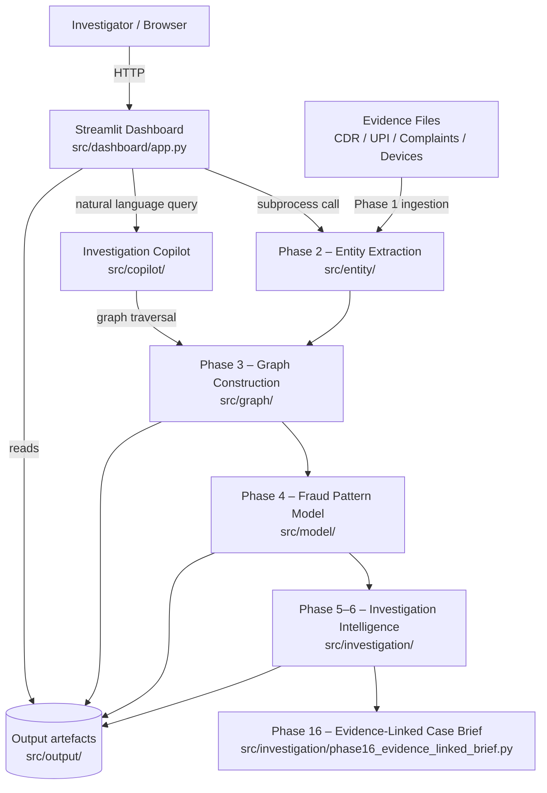

# Chanakya-Graph

> **AI Track — IBM Bob AI Hackathon | Team Hypercats**

An automated intelligence platform for cyber-syndicate deconvolution. Chanakya-Graph fuses raw, heterogeneous evidence — Call Detail Records (CDR), UPI transaction logs, victim complaint reports, and device/IMEI records — into a single directed investigation graph, classifies fraud-pattern entities with a trained ML model, and produces court-ready, evidence-linked case briefs through a browser-based investigation workstation.

---

## Table of Contents

- [Problem Statement](#problem-statement)
- [Solution Overview](#solution-overview)
- [Key Features](#key-features)
- [Architecture](#architecture)
- [Tech Stack](#tech-stack)
- [Project Structure](#project-structure)
- [IBM Technologies](#ibm-technologies)
- [Team](#team)

---

## Problem Statement

Cyber-crime investigators handling multi-victim digital financial fraud (UPI fraud, SIM-swap scams, vishing, money-mule networks) must manually reconcile CDR exports from telecom operators, UPI/IMEI transaction logs from banks, device records, and victim complaint narratives — each arriving in incompatible formats with no common entity namespace.

A single case can generate hundreds of CDR entries, dozens of layered UPI transfers, multiple IMEI records, and multiple victim complaints. Cross-referencing a caller's phone number against a bank account, linking it to an IMEI, and tracing that device to a tower and a second set of numbers can take an experienced analyst **several days per case** — consistently exceeding the critical **24–72 hour fund-interception window** recognized by RBI guidelines and court precedent.

No open, purpose-built tool exists that:
1. Accepts the exact CSV formats Indian cyber-crime investigators actually receive.
2. Automatically resolves entities across source types (e.g., recognizes `9876543210`, `+919876543210`, and `91-9876543210` as the same phone number).
3. Constructs a multi-hop investigation graph, scores entities against fraud-pattern signatures, and generates an evidence-linked case brief — all in a single pipeline operable from a browser.

> Full detail: [`docs/problem-statement.md`](docs/problem-statement.md)

---

## Solution Overview

Chanakya-Graph runs a seven-phase pipeline triggered entirely from the Streamlit investigation workstation:

| Phase | What Happens |
|---|---|
| **1 — Evidence Ingestion** | Load and validate CDR, UPI, complaint, and device CSV files; normalize phone numbers to `+91XXXXXXXXXX`; assemble a unified evidence ledger with typed record IDs. |
| **2 — Entity Extraction & Resolution** | Extract all identifiers, deduplicate across sources, and write canonical entity files. |
| **3 — Graph Construction** | Build a directed `networkx.MultiDiGraph` where nodes are canonical entities and edges carry relationship type plus originating evidence ID; render interactive PyVis HTML visualization. |
| **4 — Fraud Pattern Evaluation** | Extract per-entity graph features; classify with a `RandomForestClassifier` (300 estimators, depth 12); write confidence-ranked predictions. |
| **5–6 — Investigation Intelligence** | Generate chronological timeline, focused sub-graphs, edge-case signals, and human-readable connection explanations. |
| **16 — Evidence-Linked Case Brief** | Synthesize all findings into a structured JSON + plain-text brief labelled `OBSERVED` / `DERIVED` / `ANALYTICAL INFERENCE` — ready for court or bank submission. |
| **Copilot** | Natural-language query interface over the live graph; no LLM call required. |

> Full detail: [`docs/solution-overview.md`](docs/solution-overview.md)

---

## Key Features

- **Multi-source evidence fusion** — Accepts CDR, UPI transaction, complaint, and device CSV files and resolves all identifiers into a single canonical entity namespace without any manual mapping.
- **Interactive investigation graph** — A directed MultiDiGraph with degree/betweenness centrality metrics, rendered as a zoomable PyVis network visualization directly in the dashboard.
- **ML fraud-pattern classification** — A balanced RandomForestClassifier trained on graph features identifies mule accounts, coordination nodes, and consolidation actors with a per-entity confidence score.
- **Evidence-tier labelling** — Every finding is explicitly tagged `OBSERVED` (source record), `DERIVED` (calculated), or `ANALYTICAL INFERENCE` (model output) to protect court admissibility.
- **Investigation Copilot** — Free-text query interface; ask *"Who received money?"*, *"Show shared devices"*, or *"What is the total loss?"* and get structured answers from the live graph instantly.
- **Court-ready case brief** — Structured JSON + plain-text output ranked by confidence, with supporting evidence IDs, designed for direct submission to a bank fraud desk or prosecutor.
- **Built-in synthetic demo dataset** — A hard `data_source == "SYNTHETIC_DEMO"` validation guard prevents accidental mixing of demo and operational evidence.

---

## Architecture



> Full annotated diagram and data-flow walkthrough: [`docs/architecture.md`](docs/architecture.md)

---

## Tech Stack

| Category | Technologies |
|---|---|
| **Language** | Python 3 |
| **Dashboard** | Streamlit |
| **Graph** | NetworkX, PyVis |
| **ML** | scikit-learn (RandomForestClassifier), joblib |
| **Data** | pandas |
| **IBM Technologies** | IBM watsonx.ai *(integration-ready)*, IBM Cloud *(deployment target)* |

---

## Project Structure

```
src/
├── ingestion/          # Phase 1 — evidence loading, validation, ledger assembly
├── entity/             # Phase 2 — identifier extraction and entity resolution
├── graph/              # Phase 3 — graph construction, centrality analysis, PyVis render
├── model/              # Phase 4 — feature extraction, RandomForest training, inference
├── investigation/      # Phase 5–6 + Phase 16 — intelligence generation, case brief
├── copilot/            # Natural-language query interface over the live graph
├── dashboard/          # Streamlit multi-page investigation workstation
├── integration/        # IBM watsonx.ai integration hooks
└── output/             # Pipeline artefacts (entities, graph, predictions, briefs)
docs/
├── problem-statement.md
├── solution-overview.md
└── architecture.md
```

---

## IBM Technologies

| Technology | Role |
|---|---|
| **IBM watsonx.ai** | Integration-ready: `WATSONX_API_KEY`, `WATSONX_PROJECT_ID`, and `WATSONX_URL` are pre-configured in `src/.env.example`. Replacing the local scikit-learn predict step in `src/model/predict_patterns.py` with an `ibm/granite` endpoint call requires a single-function swap. |
| **IBM Cloud** | Deployment target: the stateless Streamlit dashboard and file-based pipeline backend are designed for IBM Cloud Code Engine or IBM Kubernetes Service, with evidence files in IBM Cloud Object Storage. |

---

## Team

**Hypercats** — IBM Bob AI Hackathon, AI Track

| Name | Role |
|---|---|
| Arun Kumar *(Lead)* | — |
| Prathamesh Jadhav | — |
| Nutan Rai | — |
| Disha Solanki | — |
