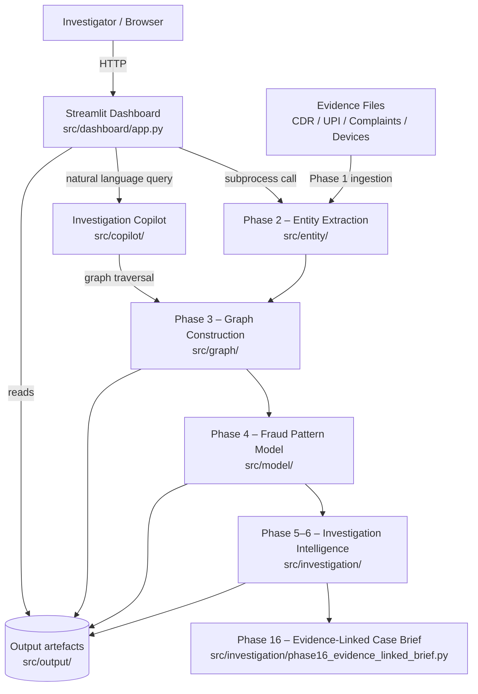

# Architecture

## System Architecture

Chanakya-Graph is a multi-phase, pipeline-driven cyber-fraud investigation platform. Raw evidence files (telecom CDR, UPI transactions, victim complaints, device/IMEI records) are ingested and progressively enriched through seven analytical phases, culminating in an interactive Streamlit investigation workstation backed by a graph database and an ML fraud-pattern model.

## Components

| Component | Technology | Responsibility |
|---|---|---|
| Investigation Dashboard | Python 3, Streamlit | Multi-page investigation workstation — Command Center, Graph Explorer, Mule Evaluation, Timeline, Final Case Brief, and nine additional investigation modules |
| Evidence Ingestion | Python / pandas (`src/ingestion/`) | Load, validate schema, normalize phone numbers and timestamps, and produce a unified evidence ledger from CDR, UPI, complaint, and device CSV files |
| Entity Extraction & Resolution | Python (`src/entity/`) | Extract raw identifiers (phone numbers, accounts, IMEI, towers) and resolve duplicates into canonical entities across all evidence sources |
| Investigation Graph | Python / NetworkX (`src/graph/`) | Build a directed MultiDiGraph of entity relationships, compute degree/betweenness centrality, identify multi-source nodes and connected components; visualize with PyVis |
| Fraud Pattern Model | scikit-learn RandomForest (`src/model/`) | Extract graph features per entity, train a balanced RandomForestClassifier (300 estimators, depth 12) to classify fraud patterns; serialize model with joblib |
| Investigation Intelligence | Python (`src/investigation/`) | Generate evidence-linked findings, timeline, edge-case analysis, connection explanations, and a structured case brief (JSON + plain text) |
| Investigation Copilot | Python / NetworkX (`src/copilot/`) | Natural-language query interface over the live graph — answers questions about transactions, recipients, shared devices/towers, cumulative losses, and entity connections |
| Case Manager | Python (`src/ingestion/case_manager.py`) | Manages active case state; supports loading operational evidence or activating synthetic demo datasets |

## Data Flow

1. **Case intake** — An investigator uploads four CSV evidence files (CDR, UPI transactions, complaints, device records) through the Streamlit Case Intake page or activates the built-in synthetic demo dataset.
2. **Phase 1 – Evidence ingestion** — `src/ingestion/evidence_ingestion.py` loads and validates each file against required column schemas, normalizes Indian phone numbers to `+91XXXXXXXXXX` format, standardizes timestamps, and assembles a flat *evidence ledger* with typed records (`EVD-CDR-*`, `EVD-UPI-*`, `EVD-COMP-*`, `EVD-DEV-*`).
3. **Phase 2 – Entity extraction and resolution** — `src/entity/` extracts all identifiers from the ledger, resolves aliases and duplicate references, and writes `output/entities/canonical_entities.json` and `output/entities/multi_source_entities.json`.
4. **Phase 3 – Graph construction** — `src/graph/graph_builder.py` constructs a directed `networkx.MultiDiGraph` where nodes are canonical entities and edges carry relationship type (`CALLED`, `TRANSFERRED_FUNDS`, `REPORTED_FRAUD_CALL`, `USED_HARDWARE`) plus the originating evidence ID. `src/graph/graph_analyzer.py` computes centrality metrics. The graph is serialized to `output/graph/investigation_graph.json` and rendered as an interactive HTML file via PyVis.
5. **Phase 4 – Fraud pattern evaluation** — `src/model/feature_extractor.py` derives numerical graph features per entity. `src/model/train_model.py` trains a `RandomForestClassifier` on labelled synthetic data and saves the model to `output/model/fraud_pattern_model.pkl`. `src/model/predict_patterns.py` runs inference and writes `output/model/predictions.json`.
6. **Phase 5–6 – Investigation intelligence** — `src/investigation/` modules generate an evidence-linked timeline, focused sub-graphs, edge-case signals, and human-readable finding explanations. `src/investigation/case_brief.py` produces a JSON + plain-text case brief sorted by prediction confidence.
7. **Phase 16 – Final evidence-linked brief** — `src/investigation/phase16_evidence_linked_brief.py` synthesizes all findings into a court-ready structured output stored in `output/investigation/`.
8. **Investigation Copilot** — The Streamlit copilot page passes free-text questions to `src/copilot/natural_language.py`, which pattern-matches against the live NetworkX graph to answer queries about transactions, cumulative losses, recipients, shared devices/towers, and entity connections without requiring a separate LLM call.

## Security Considerations

- API keys (`WATSONX_API_KEY`, `WATSONX_PROJECT_ID`) and database credentials are stored in `.env` only; `.env` is explicitly listed in `.gitignore` and a safe template is committed as `src/.env.example`.
- All evidence files are validated for a `data_source == "SYNTHETIC_DEMO"` marker before processing; non-synthetic records raise a hard validation error, preventing accidental processing of operational data in demo mode.
- Case IDs are bound to each evidence record at ingestion time; cross-case contamination triggers a validation failure in `evidence_ingestion.py`.
- The Streamlit dashboard runs backend phases as subprocess calls with a 300-second timeout, isolating backend failures from the UI process.

## Scalability Notes

The current prototype is designed for single-investigator, single-case workloads suitable for hackathon demonstration. For production scale:

- **Backend pipeline** is stateless between phases; each phase reads JSON/CSV from `output/` and writes back, making it straightforward to replace subprocess calls with a task queue (e.g., Celery + Redis) for concurrent case processing.
- **Graph store** — the in-memory NetworkX graph can be replaced with a dedicated graph database (e.g., Neo4j or IBM Db2 Graph) for corpora exceeding tens of thousands of entities without changing the analyzer interface.
- **ML model** — the scikit-learn RandomForest can be swapped for a watsonx.ai hosted model endpoint to benefit from IBM infrastructure scaling and model governance.
- **Dashboard** — Streamlit can be deployed behind an IBM Cloud Code Engine or Kubernetes ingress with multiple worker replicas; session state is already isolated per user.
