Overall Architecture
Chanakya-Graph is a Python + Streamlit AI-assisted cyber-fraud investigation platform. It ingests structured cyber-fraud evidence such as CDR records, UPI transactions, complaints, and device records, normalizes the data, extracts entities and relationships, builds an investigation graph, performs analytical detection, and presents evidence-linked findings through the dashboard.
Components
Component	Technology	Responsibility
Frontend	Streamlit	Investigation dashboard, case intake, graph visualization, timeline, evidence explorer, findings, and case brief
Application / Orchestration	Python	Coordinates the investigation pipeline and connects the different analysis phases
Data Processing	Python, Pandas, Regex	CSV ingestion, validation, normalization, preprocessing, and structured evidence processing
Entity & Relationship Extraction	Python, Regex, deterministic rules	Extracts phones, bank accounts, IMEIs, towers, persons, transactions, and relationships
Entity Resolution	Python	Normalizes identifiers and creates canonical entities across multiple evidence sources
Evidence Ledger	JSON	Maintains evidence records, provenance, source type, timestamps, and evidence IDs
Investigation Graph	NetworkX + JSON	Represents entities as nodes and investigative relationships as edges
AI / ML Analysis	Scikit-learn	Fraud-pattern classification and analytical scoring such as mule-chain, funnel-account, shared-device, and multi-hop patterns
Investigation Copilot	Python rule-based analysis	Answers investigation-oriented questions using the structured graph and evidence
Reporting	Python + JSON/TXT	Generates final case briefs and evidence-linked investigation reports
Storage	CSV + JSON files	Stores normalized evidence and generated investigation artifacts

Mermaid Architecture Diagram

```mermaid
flowchart TB
    %% =========================
    %% USER / INPUT LAYER
    %% =========================
    A["Investigator"] --> B["Streamlit Web Dashboard"]
    B --> C["Case Intake & Case Manager"]
    C --> D["Evidence Ingestion"]
    D --> D1["Transaction Records<br/>UPI / Bank"]
    D --> D2["Call Detail Records<br/>CDR"]
    D --> D3["Device Records<br/>IMEI / Phone"]
    D --> D4["Complaint Records"]
    D --> D5["Other Cyber-Fraud Intelligence"]
    %% =========================
    %% DATA PROCESSING
    %% =========================
    D1 --> E["Data Validation & Normalization"]
    D2 --> E
    D3 --> E
    D4 --> E
    D5 --> E
    E --> F["Entity Extraction"]
    F --> F1["Person"]
    F --> F2["Phone"]
    F --> F3["Bank Account"]
    F --> F4["Transaction"]
    F --> F5["IMEI / Device"]
    F --> F6["Tower / Location"]
    F --> F7["Reference ID"]
    %% =========================
    %% ENTITY RESOLUTION
    %% =========================
    F1 --> G["Entity Resolution & Canonicalization"]
    F2 --> G
    F3 --> G
    F4 --> G
    F5 --> G
    F6 --> G
    F7 --> G
    G --> H["Normalized Entities"]
    %% =========================
    %% EVIDENCE PROVENANCE
    %% =========================
    E --> I["Evidence Ledger"]
    I --> I1["Evidence ID"]
    I --> I2["Source File"]
    I --> I3["Record ID"]
    I --> I4["Timestamp"]
    I --> I5["Extraction Method"]
    I --> I6["Confidence / Status"]
    H --> J["Relationship Extraction"]
    I --> J
    %% =========================
    %% GRAPH ENGINE
    %% =========================
    J --> K["Investigation Graph"]
    K --> K1["Nodes<br/>Persons / Phones / Accounts / Devices"]
    K --> K2["Edges<br/>Calls / Transfers / Shared Devices / Towers"]
    %% =========================
    %% ANALYSIS ENGINE
    %% =========================
    K --> L["Investigation Analysis Engine"]
    L --> L1["Fraud Pattern Detection"]
    L --> L2["Money Flow Analysis"]
    L --> L3["Shared Device Analysis"]
    L --> L4["Communication Analysis"]
    L --> L5["Tower / Location Analysis"]
    L --> L6["Network / Centrality Analysis"]
    L --> L7["Timeline Analysis"]
    %% =========================
    %% ML
    %% =========================
    L --> M["Machine Learning Layer"]
    M --> M1["Mule Chain Detection"]
    M --> M2["Funnel Account Detection"]
    M --> M3["Shared Device Detection"]
    M --> M4["Multi-Hop Transaction Detection"]
    %% =========================
    %% INVESTIGATION COPILOT
    %% =========================
    K --> N["Investigation Copilot"]
    L --> N
    I --> N
    N --> N1["Natural Language Queries"]
    N --> N2["Evidence-Based Answers"]
    N --> N3["Connection Explanation"]
    %% =========================
    %% DASHBOARD
    %% =========================
    N --> B
    K --> B
    L --> B
    I --> B
    B --> O["Investigation Command Center"]
    O --> O1["Investigation Graph View"]
    O --> O2["Timeline"]
    O --> O3["Evidence Explorer"]
    O --> O4["Financial Flow"]
    O --> O5["Entity / Network View"]
    O --> O6["Explain This Connection"]
    %% =========================
    %% REPORTING
    %% =========================
    O --> P["Case Brief Generator"]
    I --> P
    L --> P
    N --> P
    P --> Q["Evidence-Linked Case Brief"]
    Q --> Q1["Case Summary"]
    Q --> Q2["Observed Evidence"]
    Q --> Q3["Derived Relationships"]
    Q --> Q4["Analytical Findings"]
    Q --> Q5["Fraud Pattern"]
    Q --> Q6["Recommended Actions"]
    Q --> R["Investigator / Authorized Authority"]
```

Data Flow
1.	Case creation
The investigator creates or loads an investigation case through the Streamlit interface.
2.	Evidence ingestion
The system accepts structured mock investigation data including:
o	CDR/call records
o	UPI transaction records
o	Complaint records
o	Device/IMEI records
3.	Normalization
Python/Pandas processes the input files and converts the records into a consistent internal structure.
4.	Entity extraction
The system identifies entities such as:
o	Phone numbers
o	Bank accounts
o	IMEIs
o	Towers
o	Persons
o	Transactions
o	References
5.	Entity resolution
Identifiers appearing across different sources are normalized and mapped to canonical entities.
6.	Evidence ledger creation
Every processed record receives an evidence reference so that findings can be traced back to the underlying source record.
7.	Graph construction
NetworkX creates an investigation graph where entities become nodes and relationships such as CALLED, TRANSFERRED_FUNDS, USED_HARDWARE, and CONNECTED_TO_TOWER become edges.
8.	Investigation analysis
The analysis layer evaluates the graph and evidence for patterns such as shared devices, funnel accounts, mule chains, and multi-hop fund movement.
9.	Investigation interface
The Streamlit dashboard exposes the results through the Investigation Command Center, graph, timeline, Evidence Explorer, Copilot, and other investigation views.
10.	Evidence-linked reporting
Findings are connected back to evidence IDs and compiled into a final case brief for human review.
Core flow
Raw Evidence
     ↓
Ingestion
     ↓
Normalization
     ↓
Entity Extraction
     ↓
Entity Resolution
     ↓
Evidence Ledger
     ↓
Investigation Graph
     ↓
AI/ML + Rule-Based Analysis
     ↓
Investigation Findings
     ↓
Timeline / Copilot / Evidence Explorer
     ↓
Evidence-Linked Case Brief
Security Considerations
•	The system is designed around evidence provenance, so analytical findings can be traced to underlying records.
•	Investigation outputs distinguish between observed evidence and analytical findings.
•	The system does not automatically make a legal guilt determination.
•	Sensitive configuration values should be kept in environment variables rather than committed to the repository.
•	Input files should be validated before processing.
•	Generated investigation reports should be treated as sensitive case information.
•	Access to the dashboard should be restricted when deploying beyond the local hackathon environment.
•	The project currently uses synthetic/mock investigation data for demonstration rather than claiming access to real banking or telecom systems.
Scalability Notes
The current architecture is intentionally lightweight for a hackathon prototype, using CSV and JSON storage with NetworkX and Streamlit.
For a production-scale version:
Streamlit / React
        ↓
FastAPI Backend
        ↓
Message Queue
        ↓
Processing Workers
        ↓
PostgreSQL + Object Storage
        ↓
Neo4j Investigation Graph
        ↓
ML / LLM Services
        ↓
Investigator Dashboard
The graph layer could move from NetworkX to Neo4j, evidence storage could move from JSON/CSV to PostgreSQL/object storage, and the Python pipeline could be separated into independently scalable processing services. This would allow substantially larger evidence collections and multiple investigators/cases to be handled concurrently.

